a.ความเป็นมาของโปรแกรม
- โปรแกรมนี้มีพื้นฐานจาก lab Pokemon รวมกับความคิดของผู้สร้างที่อยากสร้างโปรแกรมที่เกี่ยวกับ "หนังสือ"

b.วัตถุประวงค์ของโปรแกรม
- เพื่อให้ user ใช้โปรแกรมนี้สำหรับการยืมหนังสือในรูปแบบหลากหลายและมีหนังสือหลาย ๆ ประเภทผ่านทางออนไลน์ 

c.โครงสร้งของโปรแกรม (Class Diagram) ของโปรแกรม ใช้ Mermaid ในการเขียน ตัวอย่าง การเขียน Classdiagram ใน Markdown

d.ชื่อผู้พัฒนาโปรเจค
- นาย ณภัทร สีหะวงค์ รหัสนักศึกษา 653450508-7 สาขาวิทยาการณ์คอมพิวเตอร์และสารสนเทศ(CS)